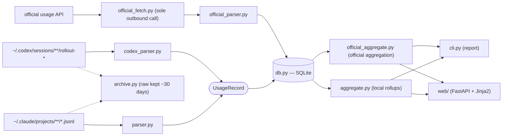

# Tokenomy

A local ledger for your AI coding token spend. Tokenomy parses your
**local** Claude Code / Codex CLI session logs and automatically reads the
official usage API — showing official limit vs. remaining, an end-of-month
surplus/shortfall forecast, cost per project/session, and cache-efficiency signals.

> Korean README: [README.md](README.md)

## Who it's for

Anyone using Claude Code and/or Codex CLI who wants to track their usage and limits.

- **Enterprise / pay-as-you-go**: the official API provides a USD limit, so you get a
  live remaining-spend and depletion forecast immediately.
- **Personal subscription**: flat-rate accounts have no USD budget, but the official API
  returns a rate-window (5 h / 7 d utilisation %) — the key actionable signal.

If you use more than one AI, you choose which ones are **active** (`tracked_providers`) —
the dashboard's "all" is the **sum of active AIs**, not the whole DB, and AIs that have a
USD limit are pooled together for a single end-of-month forecast.

If official data is unavailable (no credentials, limit-less account, or
`TOKENOMY_SKIP_OFFICIAL_FETCH` set), the app falls back to a **usage-only view**
driven by local JSONL logs.

## What it shows

- **Dashboard** — this month's combined forecast (active AIs pooled in USD for an
  end-of-month surplus/shortfall estimate), total spend (sum of active AIs), a trend
  chart (limit & projected lines), token composition, an efficiency coach, cost per
  project (Top 10), and recent expensive sessions for review (Top 10).
- **Official usage cards** — a per-provider gauge (5-hour / 7-day / monthly official
  buckets) plus a "today $ · this week $" glance. Colour encodes threshold, texture
  encodes official vs. estimated.
- **History (local)** — usage from local JSONL logs, with a **week/month toggle** and a
  **custom date range**.
- **History (official)** — the past trajectory of official usage snapshots (depleting
  limits), drillable per day (once official data has accumulated).
- **By dimension** — break spend down by model, branch, etc. (same week/month toggle and
  date range).
- **Mini view** — a small glance window that **swaps exclusively** with the main window
  (**Windows native window only** — excluded on Linux due to Wayland). Toggle it from the
  sidebar's "⊟ Mini view".

## Privacy

- Parses token **metadata** (tokens, time, project, model) plus a **short excerpt
  of the first user prompt** (for session identification). **Full conversation
  content is never stored.**
- Runs fully locally. The web dashboard binds to `127.0.0.1` only — do not
  expose it to a network.

## Viewing from another device (SSH tunnel)

If you use multiple machines (e.g. a Windows laptop for general work, an Ubuntu
desktop for AI development/builds) and want to see the usage of a headless
machine from another, **don't expose the dashboard to the network — pull it over
an SSH tunnel instead.** The app still binds to `127.0.0.1` only, and `ssh -L`
binds to 127.0.0.1 on both ends, so data stays local end to end (see ADR 0029).

```bash
# On the client (e.g. Windows laptop) — forward the remote (e.g. Ubuntu) 8765 locally
ssh -L 8765:127.0.0.1:8765 <remote-host>
# then open http://localhost:8765 in the client browser
```

- The port is usually `8765` but drifts to `8766`~`8784` if taken — if so, check
  the actual port in the remote's `<data>/runtime.json` (source runs use
  `<repo>/data/runtime.json`).
- The remote app just needs to be running (the server keeps serving on
  `127.0.0.1` even when the window is hidden to the tray).
- The reverse direction (e.g. viewing Windows from Ubuntu) is symmetric — enable
  **OpenSSH Server** on Windows (off by default) and use the same one-liner.

## Quick start (non-developer — Windows)

1. Download `Tokenomy.exe` from
   [Releases](https://github.com/genius-kim-samsung/tokenomy/releases/latest).
2. Double-click it. (If Windows SmartScreen warns, click **More info → Run
   anyway** — it's the normal warning for an unsigned personal tool.)
3. The Tokenomy app window opens with the dashboard. Data is stored under
   `C:\Users\<you>\.tokenomy\` (in the `data\` and `config\` subfolders).
   **The window's X button hides to the tray** (it does not quit) — right-click the
   tray icon → "Quit" to exit fully. Use the sidebar's **⊟ Mini view** to switch to a
   small at-a-glance window.
4. When a new version ships, the dashboard shows an update banner — click it,
   download the new `Tokenomy.exe`, and overwrite the old one.

On first run, if you've never used Claude Code / Codex (no credentials), you'll see a
**getting-started card** instead of an empty dashboard.

## Quick start (developer — from source)

This path is for modifying/contributing to the code, or running on Linux. **Windows end users should use the exe above** — running from source isn't needed.

```bash
pip install -r requirements.txt
cp config/tokenomy.config.example.json config/tokenomy.config.json
python -m tokenomy.cli ingest
python -m tokenomy.cli report
python -m uvicorn tokenomy.web.app:app --host 127.0.0.1 --port 8765
```

On Windows, double-click `start_tokenomy.bat` (ingest → dashboard → opens browser).

## Install on Ubuntu 24.04 LTS (native window + tray)

On Linux, instead of a single binary Tokenomy runs **from source** for a native
experience — `install.sh` handles system dependencies, the virtualenv, and app-menu
registration in one go. You get the main window plus a resident tray; the mini view is
**dropped on Linux** due to Wayland (GNOME) constraints (the main window and tray are
Wayland-clean).

### Prerequisites

- Ubuntu 24.04 LTS desktop (GNOME). You need `git` and `sudo` access.
- An account that has used Claude Code / Codex CLI / gemini-cli — official usage is read from
  `~/.claude/.credentials.json`, `~/.codex/auth.json`, and `~/.gemini/oauth_creds.json`
  automatically (it still works without them, using local logs only).
- Enterprise Gemini additionally needs the `GOOGLE_CLOUD_PROJECT` (GCP project) env var —
  but **launching from the app menu does not read `~/.bashrc`**, so follow the placement in
  [Troubleshooting](#troubleshooting) below.

### Install

```bash
# 1) Get the code
git clone https://github.com/genius-kim-samsung/tokenomy.git
cd tokenomy

# 2) Install — apt system deps (prompts for your sudo password) + venv + Python packages + app-menu entry
./install.sh
```

What `install.sh` does:

1. Installs **apt system packages** — `python3-gi`, `gir1.2-gtk-3.0`, `gir1.2-webkit2-4.1`,
   `libwebkit2gtk-4.1-0` (pywebview's GTK/WebKit backend) and `libayatana-appindicator3-1`,
   `gir1.2-ayatanaappindicator3-0.1` (the tray icon).
2. Creates the **virtualenv** with `python3 -m venv --system-site-packages .venv`. The
   `--system-site-packages` flag lets it see the apt-provided `python3-gi` (PyGObject),
   avoiding a painful pip build of PyGObject.
3. Installs the **Python packages** (`requirements.txt`).
4. **Registers the app menu** — copies `tokenomy.desktop` (with the real path substituted in)
   to `~/.local/share/applications/`.

### Run

```bash
./start_tokenomy.sh      # from a terminal
```

Or, after installing, search for **"Tokenomy" in the app menu (Activities)** and click it.
It ingests your local logs, opens the dashboard in a native window, and adds a tray icon to
the top bar.

- **Window X = hide to tray** (not quit). To bring it back: tray icon → "Open".
- **Quit fully**: right-click the tray icon → "Quit".
- Data accumulates under the cloned directory (`data/`, `config/`).
- (Note) The mini-view button does not appear on Linux — this is intentional.

### Update

```bash
cd tokenomy
git pull
# only if requirements.txt changed:
.venv/bin/python -m pip install -r requirements.txt
```

### Troubleshooting

- **`install.sh` stalls at the apt step (especially `gir1.2-webkit2-4.1` /
  `libwebkit2gtk-4.1-0`)** — your apt mirror may not carry the package. Run
  `sudo apt-get update`, then `apt-cache policy libwebkit2gtk-4.1-0` to confirm a candidate
  version is available (WebKit2GTK 4.1 is standard on 24.04).
- **Window opens but no tray icon** — the AppIndicator extension may be disabled in GNOME.
  Ubuntu enables it by default; check with `gnome-extensions list` that
  `appindicatorsupport` or `ubuntu-appindicators` is enabled.
- **Official usage is empty** — if you've never logged in with Claude Code / Codex there are
  no credential files, so only local-log data shows. Log in / use them once and official
  numbers fill in on the next run.
- **Only Gemini official usage is missing (claude/codex are fine)** — enterprise Gemini needs
  the GCP project set via the `GOOGLE_CLOUD_PROJECT` env var. But **launching from the app menu
  (icon) does not read `~/.bashrc`**, so a value you only `export`ed in your shell never reaches
  the app (`echo $GOOGLE_CLOUD_PROJECT` shows it in a terminal, yet it's absent from the app
  process). Put it where both the GUI and terminal read it, then **log out / back in** of the
  desktop session:
  ```bash
  # System-wide (recommended, sudo once) — applies to GUI, terminal, and SSH
  echo "GOOGLE_CLOUD_PROJECT=<your-project>" | sudo tee -a /etc/environment
  # or per-user without sudo: echo 'export GOOGLE_CLOUD_PROJECT=<value>' >> ~/.profile
  ```
  Verify after re-login:
  ```bash
  tr '\0' '\n' < /proc/"$(pgrep -f tokenomy.launcher | head -1)"/environ | grep GOOGLE_CLOUD_PROJECT
  ```
  The existing line in `~/.bashrc` is harmless to keep (after re-login new terminals get this value too).

## Configuration

Edit `config/tokenomy.config.json`, or use the **Settings** page in the
dashboard (`/settings`):

```json
{
  "user_label": "me",
  "tracked_providers": ["claude", "codex"],
  "credit_to_usd": 0.04,
  "official_fetch": { "min_interval_minutes": 10 },
  "pricing_overrides": {}
}
```

- `tracked_providers`: the **active AIs** — which AI tools to fetch official usage for
  and show on the dashboard. The dashboard's "all" is the sum of this set. Auto-seeded on
  first run from whichever credential files are present (`~/.claude/.credentials.json`,
  `~/.codex/auth.json`). Limits and remaining are sourced from the official API —
  enterprise/pay-as-you-go accounts see a USD limit; personal subscription accounts see a
  rate-window (%).
- `credit_to_usd`: the rate used to convert Codex credits to USD (default 0.04). A
  separate constant from the token-pricing path.
- `official_fetch.min_interval_minutes`: the official-usage **auto-refresh interval**
  (minutes, default 10). It's both the polling cadence while a page is open and the
  minimum gap between automatic calls (the manual refresh button ignores it).
- `pricing_overrides`: override per-model rates if your billing differs from
  public list prices, or **add a new model** without waiting for an app update
  (takes effect on the next ingest):

  ```json
  "pricing_overrides": {
    "opus":    { "input": 4.0, "output": 20.0 },
    "gpt-5.6": { "provider": "codex", "input": 5.0, "output": 30.0, "cache_read": 0.5 }
  }
  ```

  Keys are partial-match tokens against the model id. A new key is added as a
  fresh pricing entry; a more specific key takes precedence over a broader one
  (e.g. `gpt-5.6` beats `gpt-5`). Unrecognised or suspect models are surfaced
  in the **Pricing Coverage** card on the Settings page.

## Data sources

- Claude Code: `~/.claude/projects/**/*.jsonl` (per-message usage + cache).
- Codex CLI: `~/.codex/sessions/**/rollout-*.jsonl` (per-session cumulative).

## Pricing

`config/pricing.json` ships with public API list prices. Update them as
providers change prices, or override per-user via `pricing_overrides`. Change a
price and the next ingest recalculates existing costs automatically — no need to
re-ingest your raw logs.

## Official usage fetch

Tokenomy automatically fetches live official usage for each provider listed in
`tracked_providers`. It uses the locally stored OAuth token and makes a single
HTTP GET per provider (≤ 3 s, no retry). **No PII is stored** — the access token
and account ID are used only for the request header and then discarded; only
usage numbers are written to the local DB. If the token is about to expire (or a
call returns 401), Tokenomy conditionally refreshes it and writes it back to the
credential file atomically — skipped on machines that used that CLI recently
(`auto_refresh_token`: `auto` (default) / `always` / `off`).

- **Fetching is decoupled from ingest.** Ingest only re-scans local JSONL; the dashboard
  drives official refresh — opening a page auto-polls (every `min_interval_minutes`), and
  a card's **refresh button** forces an immediate update, ignoring the interval.
- **Default-on** for providers in `tracked_providers`; accounts with no official data
  (e.g. limit-less) fall back to a usage-only view.
- Set `TOKENOMY_SKIP_OFFICIAL_FETCH` to disable all network calls (offline /
  CI / testing).

## Architecture

One-way data pipeline — local logs and the official API meet in SQLite, then flow into aggregation and views:



## Adding a parser for another tool

Tokenomy normalizes each tool's logs into `UsageRecord` (see
`tokenomy/parser.py`). To support another CLI, write a module that discovers
its log files and yields `UsageRecord`s, then ingest them via
`tokenomy.db.ingest_records(conn, records, pricing)` — see
`tokenomy/codex_parser.py` as a reference implementation. For official usage, see
`tokenomy/official_parser.py` (`OfficialBucket` + `credit_to_usd` conversion).

## License

MIT — see [LICENSE](LICENSE).
