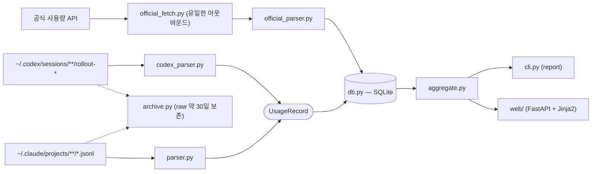

# Tokenomy (토큰 가계부)

AI 코딩 토큰 지출을 가계부처럼 관리하는 **로컬** 도구. Claude Code / Codex CLI의
로컬 세션 로그를 파싱하고, 공식 사용량 API를 자동으로 읽어 — 공식 한도 대비
잔여·예측, 월말 여유/부족 전망, 프로젝트/세션별 비용, 캐시 효율 신호를 보여준다.

> English README: [README.en.md](README.en.md)

## 누구를 위한 도구인가

Claude Code / Codex CLI를 쓰며 자기 사용량·한도를 추적·관리하려는 사용자.

- **엔터프라이즈/종량제**: 공식 API가 USD 한도를 제공하므로 공식 잔여·소진 예측이 바로 뜬다.
- **개인 구독제**: 정액제라 USD 예산은 없지만, 공식 API가 주는 rate-window(5h/7d 이용률 %)가 핵심 신호다.

여러 AI를 함께 쓰면 화면에 표시할 **활성 AI**(`tracked_providers`)를 골라 둔다 — 대시보드의
"전체"는 DB 전체가 아니라 **활성 AI 합산**이며, 한도 있는 AI들은 하나의 USD 풀로 묶여 전망된다.

공식 데이터가 없는 경우(크레덴셜 없음·취득 skip·또는 한도 미제공 계정)는 로컬 JSONL 기반 **사용량 전용 view**로 동작한다.

## 무엇을 보여주는가

- **대시보드** — 이번 달 통합 전망(활성 AI를 USD 풀로 합쳐 월말 여유/부족 추정), 총지출(활성 AI 합산),
  추세 차트(한도선·예상선), 토큰 구성, 효율 코치, 폴더 사용량(이 기기·Top 10), 복기용 최근 비싼 세션(Top 10).
- **공식 사용량 카드** — provider별 게이지(5시간·7일·월간 등 공식 버킷)와 "오늘 $·이번주 $" 글랜스.
  색=임계, 텍스처=공식/추정으로 구분한다.
- **사용 이력(로컬)** — 로컬 JSONL 기반 사용 내역. **주/월 토글**과 **사용자 지정 날짜 구간**으로 조회.
- **사용 이력(공식)** — 공식 사용량 스냅샷의 과거 궤적(소진형 한도)을 일별로 드릴다운(공식 데이터가 쌓인 경우).
- **기준별** — 모델·브랜치 등 기준으로 비용을 쪼개 본다(주/월 토글·날짜 구간 동일).
- **미니 뷰** — 큰 창과 **배타 전환**되는 작은 글랜스 창(**Windows 네이티브 창 한정** — Linux는 Wayland 제약으로 제외). 사이드바 "⊟ 미니뷰"로 전환.

## 프라이버시

- 토큰 **메타데이터**(토큰/시간/프로젝트/모델)와 **세션 식별용 첫 프롬프트 발췌**만 저장한다. **전체 대화 기록은 저장하지 않는다.**
- 완전 로컬 실행. 웹 대시보드는 `127.0.0.1` 에만 바인딩 — 외부에 노출하지 말 것.

## 빠른 시작 (비개발자 — Windows)

1. [Releases](https://github.com/genius-kim-samsung/tokenomy/releases/latest)에서
   `Tokenomy.exe`를 내려받는다.
2. 더블클릭한다. (Windows SmartScreen 경고가 뜨면 **추가 정보 → 실행**을 누른다 —
   서명되지 않은 개인 도구라 뜨는 정상 경고다.)
3. Tokenomy 앱 창이 열리며 대시보드가 표시된다. 데이터는
   `C:\Users\<이름>\.tokenomy\`(`data\`·`config\` 하위)에 저장된다.
   **창 X 버튼은 트레이로 숨김**(종료 아님) — 트레이 우클릭 → "종료"로 완전 종료.
   사이드바의 **⊟ 미니뷰**로 작게 흘끗 보는 창으로 전환할 수 있다.
4. 새 버전이 나오면 대시보드 상단에 알림 배너가 뜬다 — 눌러서 새 `Tokenomy.exe`를
   받아 기존 파일을 덮어쓰면 된다.

처음 실행 시 Claude Code/Codex를 한 번도 쓰지 않아 크레덴셜이 없으면, 빈 화면 대신 **시작 안내 카드**가 뜬다.

## 빠른 시작 (개발자 — 소스 실행)

코드를 수정·기여하거나 Linux에서 쓰는 경로다. **Windows 최종 사용자는 위의 exe**를 쓰면 되고, 소스 실행은 따로 필요 없다.

```bash
pip install -r requirements.txt
cp config/tokenomy.config.example.json config/tokenomy.config.json
python -m tokenomy.cli ingest
python -m tokenomy.cli report
python -m uvicorn tokenomy.web.app:app --host 127.0.0.1 --port 8765
```

Windows는 `start_tokenomy.bat` 더블클릭(ingest → 대시보드 → 브라우저 자동 오픈).

## Ubuntu 24.04 LTS 설치 (네이티브 창 + 트레이)

Linux는 단일 바이너리 대신 **소스 실행**으로 네이티브 경험을 준다 — `install.sh`가 시스템
의존성·가상환경·앱 메뉴 등록까지 한 번에 처리한다. 큰 창 + 트레이 상주를 제공하며,
미니 뷰는 Wayland(GNOME) 제약으로 **Linux에선 빠진다**(큰 창·트레이는 Wayland-clean).

### 준비물

- Ubuntu 24.04 LTS 데스크톱(GNOME). `git`과 `sudo` 권한이 필요하다.
- Claude Code / Codex CLI를 쓰던 계정 — 공식 사용량은 `~/.claude/.credentials.json`,
  `~/.codex/auth.json`을 읽어 자동으로 뜬다(없어도 로컬 로그 기반으로는 동작).

### 설치

```bash
# 1) 코드 받기
git clone https://github.com/genius-kim-samsung/tokenomy.git
cd tokenomy

# 2) 설치 — apt 시스템 의존성(sudo 비밀번호를 물어봄) + 가상환경 + 파이썬 패키지 + 앱 메뉴 등록
./install.sh
```

`install.sh`가 하는 일:

1. **apt 시스템 패키지** 설치 — `python3-gi`·`gir1.2-gtk-3.0`·`gir1.2-webkit2-4.1`·
   `libwebkit2gtk-4.1-0`(pywebview의 GTK/WebKit 백엔드)와 `libayatana-appindicator3-1`·
   `gir1.2-ayatanaappindicator3-0.1`(트레이 아이콘).
2. **가상환경** 생성 — `python3 -m venv --system-site-packages .venv`. `--system-site-packages`라
   apt로 받은 `python3-gi`(PyGObject)를 그대로 본다(PyGObject를 pip로 빌드하는 고통 회피).
3. **파이썬 패키지** 설치(`requirements.txt`).
4. **앱 메뉴 등록** — `tokenomy.desktop`을 실제 경로로 치환해 `~/.local/share/applications/`에 복사.

### 실행

```bash
./start_tokenomy.sh      # 터미널에서
```

또는 설치 후 **앱 메뉴(Activities)에서 "Tokenomy"** 를 검색해 클릭한다. 실행하면 로컬 로그를
수집(ingest)한 뒤 네이티브 창에 대시보드가 뜨고, 상단 표시줄에 트레이 아이콘이 생긴다.

- **창 X = 트레이로 숨김**(종료가 아니다). 다시 보려면 트레이 아이콘 → "열기".
- **완전 종료**는 트레이 아이콘 우클릭 → "종료".
- 데이터는 클론한 디렉터리 아래(`data/`·`config/`)에 쌓인다.
- (참고) 미니 뷰 버튼은 Linux에선 나오지 않는다 — 의도된 동작이다.

### 업데이트

```bash
cd tokenomy
git pull
# requirements.txt가 바뀐 경우에만:
.venv/bin/python -m pip install -r requirements.txt
```

### 문제 해결

- **`install.sh`가 apt 단계에서 멈춤(특히 `gir1.2-webkit2-4.1`/`libwebkit2gtk-4.1-0`)** —
  사내 apt 미러에 해당 패키지가 없을 수 있다. `sudo apt-get update` 후 `apt-cache policy
  libwebkit2gtk-4.1-0`로 후보 버전이 잡히는지 확인한다(24.04는 WebKit2GTK 4.1이 표준).
- **창은 뜨는데 트레이가 안 보임** — GNOME에 AppIndicator 확장이 꺼져 있을 수 있다. Ubuntu는
  기본 활성이지만, `gnome-extensions list`로 `appindicatorsupport` 또는 `ubuntu-appindicators`가
  활성인지 확인한다.
- **공식 사용량이 비어 있음** — Claude Code/Codex로 로그인한 적이 없으면 크레덴셜 파일이 없어
  로컬 로그 기반으로만 뜬다. 한 번 로그인/사용하면 다음 실행부터 공식 수치가 채워진다.

## 설정

`config/tokenomy.config.json` 을 편집하거나 대시보드의 **설정**(`/settings`) 화면에서:

```json
{
  "user_label": "me",
  "tracked_providers": ["claude", "codex"],
  "credit_to_usd": 0.04,
  "official_fetch": { "min_interval_minutes": 10 },
  "pricing_overrides": {}
}
```

- `tracked_providers`: 공식 사용량을 취득하고 대시보드에 표시할 **활성 AI** 목록. 화면의 "전체"는
  이 집합의 합산이다. 첫 실행 시 크레덴셜 파일(`~/.claude/.credentials.json`, `~/.codex/auth.json`)
  존재로 자동 시드된다. 한도·잔여는 공식 API 응답이 정본 — 엔터프라이즈/종량제는 USD 한도,
  개인 구독제는 rate-window(%) 표시.
- `credit_to_usd`: Codex 크레딧을 USD로 환산하는 단가(기본 0.04). 토큰 단가 경로와 분리된 별도 상수.
- `official_fetch.min_interval_minutes`: 공식 사용량 **자동 갱신 간격**(분, 기본 10). 창이 열린 동안
  자동 폴링하는 주기이자 자동 호출의 최소 간격이다(수동 새로고침 버튼은 이 간격을 무시한다).
- `pricing_overrides`: 청구 단가가 공개 단가와 다르면 모델별로 덮어쓰거나, 앱 업데이트를
  기다리지 않고 **새 모델을 추가**한다(다음 ingest부터 반영):

  ```json
  "pricing_overrides": {
    "opus":    { "input": 4.0, "output": 20.0 },
    "gpt-5.6": { "provider": "codex", "input": 5.0, "output": 30.0, "cache_read": 0.5 }
  }
  ```

  키는 모델 id에 대한 부분일치 토큰이다. 새 키는 새 단가 항목으로 추가되고, 더 구체적인
  키가 더 거친 키보다 우선한다(예: `gpt-5.6`이 `gpt-5`를 앞선다). 미식별·의심 모델은
  설정 페이지의 **단가 커버리지(Pricing Coverage)** 카드에 노출된다.

## 데이터 소스

- Claude Code: `~/.claude/projects/**/*.jsonl` (메시지별 usage + cache)
- Codex CLI: `~/.codex/sessions/**/rollout-*.jsonl` (세션별 누적)

## 가격(단가)

`config/pricing.json` 에 공개 API 단가가 기본값으로 제공된다. 단가가 바뀌면 갱신하거나,
`pricing_overrides` 로 사용자별로 덮어쓴다. 단가를 바꾸면 다음 ingest가 기존 비용을
자동으로 재계산한다 — raw 로그를 다시 적재할 필요가 없다.

## 공식 사용량 자동 취득

`tracked_providers`(활성 AI)에 등록된 provider별로 로컬 OAuth 토큰을 사용해
공식 API를 단발 호출(≤3s, 백오프 없음)하고, Claude 월 한도·Codex 월 크레딧 한도 등 공식 버킷을 미러링한다.
**사용량 수치만 저장**한다(토큰·계정 식별자 미저장 — 요청 헤더에만 쓰고 버린다).
토큰이 만료 임박이거나 호출이 401을 받으면 **조건부로 능동 갱신**해 크레덴셜 파일에 안전하게(원자적 교체)
되써 준다 — 해당 CLI를 최근 쓴 기기에서는 충돌을 피해 갱신하지 않는다
(`auto_refresh_token`: `auto`(기본) / `always` / `off`).

- **갱신은 수집(ingest)과 분리**된다. 수집은 로컬 JSONL 재스캔만 하고, 공식 갱신은 대시보드가
  담당한다 — 페이지를 열면 자동 폴링(`min_interval_minutes` 간격)하고, 카드의 **새로고침 버튼**은
  간격을 무시하고 즉시 갱신한다.
- 공식 데이터를 한 번도 못 얻은 경우 **사용량 전용 view**로 폴백한다.
- 환경변수 `TOKENOMY_SKIP_OFFICIAL_FETCH`로 전체 강제 차단 가능(오프라인/CI 용).

## 아키텍처

단방향 데이터 파이프라인 — 로컬 로그와 공식 API가 SQLite에서 만나 집계·화면으로 흐른다:



## 다른 도구용 파서 추가

Tokenomy는 각 도구의 로그를 `UsageRecord`(`tokenomy/parser.py` 참고)로 정규화한다.
다른 CLI를 지원하려면 그 도구의 로그 파일을 찾아 `UsageRecord`를 생성하는 모듈을
작성한 뒤 `tokenomy.db.ingest_records(conn, records, pricing)` 로 적재한다 —
`tokenomy/codex_parser.py` 를 참고 구현으로 보면 된다. 공식 사용량 파서는
`tokenomy/official_parser.py`(`OfficialBucket` + `credit_to_usd` 환산)를 참고.

## 라이선스

MIT — [LICENSE](LICENSE) 참고.
